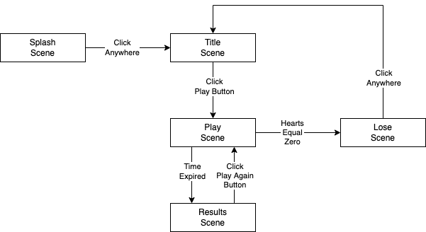
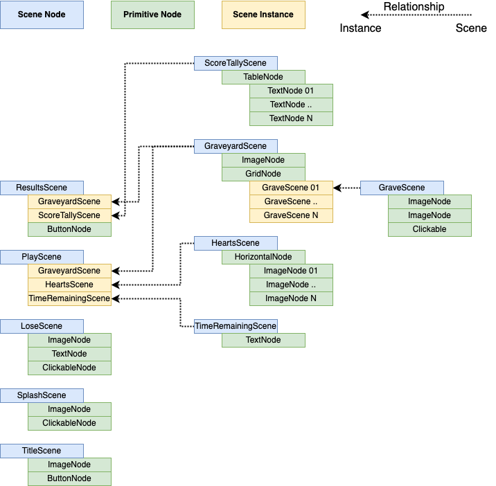

# Whack A Zombie

I am thinking a zero dependency tech stack with styling in CSS, functionality in modern JS (ES6+) and minimal HTML boilerplate.

For the game, I am thinking about an arcade style "whack a mole" themed for Halloween using zombies crawling out of open graves as the "moles"

- You begin the game with five hearts and zero points.
- There are three rows of 4 graves which are initially empty.
- After a 3,2,1 countdown, zombies will begin to appear in the open graves for a random amount of time.
- The goal of the game is to whack/kill as many zombies and gain as many points as you can in 60 seconds.
- Click on a zombie to gain N points (N is based on amount of time zombie is visible, lower time, higher score)
- Click on an open grave, and you lose a heart.
- If you lose all of your hearts, you lose the game.
- After 60 seconds, a tally of your score will be displayed along with a button to play again.
- Clicking on play again will clear the score, reset the zombies, hearts, and begin the 3,2,1 countdown again

## Architecture

The game will be designed at a high level using a concept of a Scene Tree where each Node of the tree represents something that you see on the screen.

- Everything in the game will be a Node.
- There is a single **Root** Node with the type "Root" which all other Nodes will be a child of.
- A Scene is a Node with the type "Scene".
- Each Scene is built from various Nodes that provide specific functionality depending on the type of Node.
- Scenes may be nested by _Instancing_ a Scene as a child Node of another Scene.
- Basic Primitive Node types will be developed for reuse to serve as the _base library_ upon which game-specific Scenes build.

### Scene Navigation

The diagram below shows how the game will flow from one scene to the next.

### Scene Tree

The diagram below shows the high level architecture of each scene of the game.

## Coding

You should read through the [Coding Patterns](./docs/patterns.md) and [Coding Conventions](./docs/conventions.md) documents.
